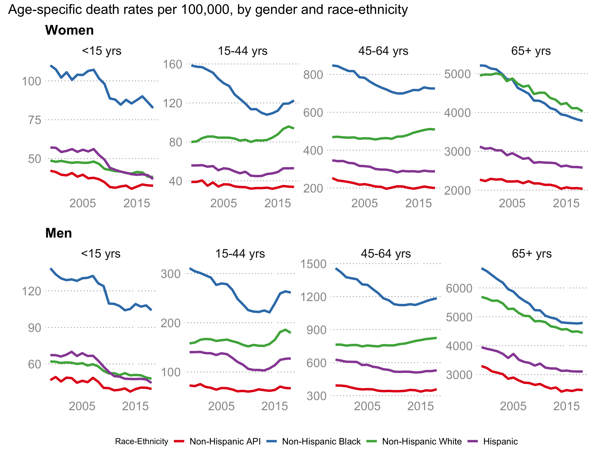
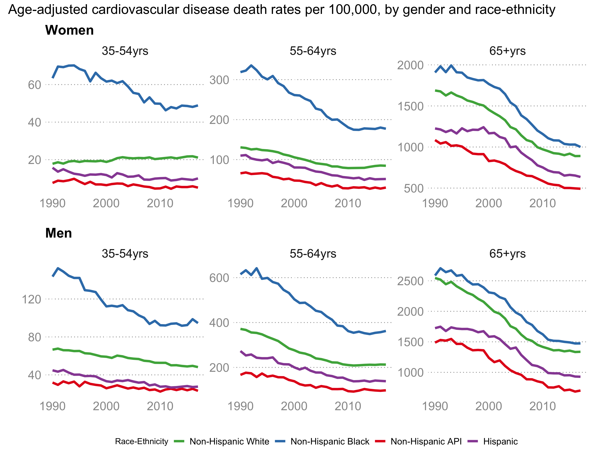

```{r setup, include=FALSE}
knitr::opts_chunk$set(echo = FALSE)
```

# | INTRODUCTION

In 2015, life expectancy at birth declined in the United States for the first time in over two decades. Subsequent declines in 2016 and 2017 led many to wonder whether health in the US was deteriorating on a large scale and, if so, what might be the cause. The magnitude of the decline was small. Life expectancy at birth declined from 78.9 years in 2014 to 78.6 years in 2017, recovering in 2018 to 78.7. Given the ongoing mortality crisis related to opioid overdoses, these declines prompted more detailed investigations of recent US mortality trends [@dowell2017; @geronimus2019; @harper2017; @ho2018; @mehta2020; @woolf2019]. In this article, we describe recent changes in US life expectancy and mortality, explore the hypothesized causes of these changes, and discuss the potential for interventions to alter their trajectories. 

# | THE US IN INTERNATIONAL CONTEXT

The US lags behind other rich countries in life expectancy, for both women and men (Supplementary Figure 1), dropping from the 16th highest among 30 Organisation for Economic Co-operation and Development (OECD) countries in 1970 to 23rd in 2017 [@nrc2010]. Year-to-year changes in life expectancy at birth (Supplementary Figure 2) demonstrate that the decrease in US life expectancy in 2015 was not a sharp turnaround, but rather part of a trend of worsening mortality that began in the late 2000s.

There is no single overarching explanation for the relatively low ranking of US life expectancy relative to other OECD countries [@crimmins2011; @nrc2013]. Two dimensions largely agreed upon are that the US deficit applies to nearly the entire age distribution, and that the poor international ranking of the US is not a consequence of larger subgroup inequalities within the US--restrictions to non-Hispanic whites also show poor performance [@nrc2013]. At ages beyond 50, where most mortality occurs, the primary reasons for comparatively worse life expectancy gains in the US since 1980 are diseases affected by smoking (lung cancer, stroke, and respiratory diseases), particularly among women, as well as deaths due to Alzheimer’s disease and related conditions [@crimmins2011]. Although the epidemic of cardiovascular disease came earlier in the US [@mensahgeorgea.2017; @stallones1980], declines in CVD were as strong in the 1980s in the US as in other countries, and do not explain its deteriorating international ranking. Above age 75 the US performs well, but at younger ages the US fares particularly badly, notably for men younger than 50 [@ho2013; @nrc2013]. The US generally has higher rates of infant mortality, motor vehicle crashes, HIV, and violent deaths at younger ages compared to other rich countries. 

Although the gap in life expectancy between the US and other high income countries has grown since 2010 [@ho2018], slowdowns in the pace of life expectancy increase have also been seen in other countries [@fenton2019]. In particular, Western European countries have generally shown smaller gains than Eastern European countries in recent years. Life expectancy in Canada has also recently slowed, and failed to increase for the first time in four decades between 2016 and 2017 [@statisticscanada2019]. Stagnating life expectancy is thus not exclusively limited to the US.

# | NARRATIVES OF CHANGING US LIFE EXPECTANCY

The literature around the decline in US life expectancy has been dominated by the “deaths of despair” narrative first proposed by Case and Deaton [@case2015] in 2015 (though the tagline didn’t appear until 2017). While many of the empirical claims in their work have been critiqued and revised [@case2017; @gelman2016; @masters2018; @mehta2016; @schmid2016a], the narrative has persisted and gained considerable traction in the media and policy arenas. Case and Deaton argue that deteriorating life expectancy is driven by premature mortality from suicide, drug poisoning, and alcohol-related illnesses among middle-aged non-Hispanic whites with low education, particularly in areas that have suffered economic stagnation or decline during the preceding two decades. Distal economic conditions and proximal mortality causes are linked via the construct of “despair,” which they consider to be a “convenient label, indicating the link with unhappiness, the link with mental and behavioral health, and the lack of any infectious agent” [@case2020]. In later work Case and Deaton link apparent increases in pain, social isolation, and family instability during this period to despair, it remains an ill-defined psychosocial mechanism. 

Narratives matter because they can synthesize and simplify complex phenomena into a single cause-and-effect story. They identify heroes and villains, emphasize particular causes and populations, set the agenda for interventions, and minimize alternative explanations and solutions. While they may be evidence-based, their traction derives from weaving what evidence is available into a seamless yet flexible story with moral, political, and cultural salience. Since its initial appearance, the “deaths of despair” narrative has developed into a powerful indictment of structural factors affecting the white working class in the US [@case2020]. This narrative has been seized upon by commenters across the political spectrum, emphasizing everything from declining church attendance to capitalism itself as component causes. The rise and popularity of the “deaths of despair” narrative has provoked critiques and alternative accounts of changes in life expectancy [@masters2018; @shanahan2019], but to have explanatory power, any narrative about declining US life expectancy must be reconciled with mortality trends across different population groups and geographic areas, as well as documenting links to plausible proximate factors. 

# | WHAT HAPPENED? RECENT TRENDS IN MORTALITY

The national picture of life expectancy hides important heterogeneity. Figure \@ref(fig:fig1) shows life expectancy at birth from 1999 to 2018 by gender and race-ethnicity (with the exception of American-Indians and Alaska Natives, for whom accurate life expectancy calculations are not generally available, see Supplement). These trends show a slowdown in life expectancy gains occurring around 2010 among all groups, both men and women, but also large and persistent inequalities by gender and race (see Supplementary Table 1 for estimates).

(ref:f1) Life expectancy at birth in the United States, by gender and race-ethnicity, 1999-2018. Source: Author’s calculations of data from CDC WONDER [@wonder2020]. Data: https://osf.io/4s2rz/ Code: https://osf.io/hz864/

```{r fig1, fig.cap='(ref:f1)', out.width="100%"}

```

## Race and Ethnicity

Figure \@ref(fig:fig1) illustrates the magnitude of race-ethnic differences in US mortality. These differences are large, much larger, in fact, than the recent 0.3 year decrease in overall life expectancy. Although recent attention has focused on rising mortality among non-Hispanic whites, death rates for non-Hispanic blacks at younger ages are still nearly double those of their white counterparts, reflecting persistent inequalities [@bosworth2018; @satcher2005]. However, recent trends also illustrate that race-ethnic inequalities are not static. For example, the large gap in life expectancy between non-Hispanic black and non-Hispanic white men has declined steadily since 1999--a continuation of positive trends evident since the mid-1990s [@harper2012; @harper2007; @macinko2009]. By and large Hispanic men and women have maintained their mortality advantage, though recent trends for younger Hispanics are not optimistic.

Although we do not present estimates of life expectancy for the American Indian / Alaska Native population because of issues of misclassification on death certificates [@arias2008], inequalities between American Indian and Alaska Natives and the rest of the US population are large [@jones2006; @kunitz2008], and are likely growing after a period of decline in the 1970s and 1980s. Mortality rates began to rise among American Indian and Alaska Natives in the late 1980s [@kunitz2008], and recent estimates suggest the difference in life expectancy at birth is nearly 6 years [@indianhealthservice2019].

## Gender

Figure \@ref(fig:fig1) also shows important differences in life expectancy by gender. The gap between US men and women had been shrinking for most race-ethnic groups over the course of the 20th and early 21st century, and has provoked some discussion about why mortality trends for women have been lagging [@crimmins2019]. Several studies, primarily using counties as the unit of analysis, reported stagnating or declining life expectancy for women during the 1990s and 2000s [@ezzati2008; @kindig2013; @wang2013]. Most of these analyses cite changes in migration or health behaviors as potential mechanisms, but few were designed to provide inference about causes. 

Since around 2010, declines in the gender gap in life expectancy have stalled or reversed (see Supplementary Figure 3). This reversal is more pronounced at younger ages, and especially among non-Hispanic blacks (even at older ages). There has been little analysis of this reversal, but faster increases in recent opioid overdose deaths among men seem a likely explanation.

## Age

Overall trends also hide important heterogeneity by age. Supplemental Figure 4 shows recent trends in life expectancy at age 25 and at age 65, by race-ethnicity and gender. Trends for life expectancy at age 25 largely mirror those at birth, suggesting that the overall picture is not a consequence of adverse mortality changes at ages below 25. At age 65, we see consistent increases for non-Hispanic Asian/Pacific Islanders and Hispanics, but also a notable stagnation of gains among non-Hispanic whites and, to a lesser extent, non-Hispanic blacks.

To provide a better sense of age-related mortality changes, Figure \@ref(fig:fig2) shows age-specific mortality trends for broad age groups, by race-ethnicity and gender (Supplemental Figures 5 and 6 also show trends for single years of age for women and men aged 25-64, respectively). Mortality rates increased among all race-ethnic groups ages 15 to 44 in the last decade, but among those ages 45 to 64, recent race-ethnic patterns have diverged: for Hispanics death rates have been relatively steady since 2010, whereas rates among non-Hispanic blacks and non-Hispanic whites have increased [@curtin2019]. Death rates for those 65 and over have generally continued to decline in the past two decades, but the pace of decline has slowed in recent years. 

(ref:f2) Age-specific mortality rates in the United States, by gender and race-ethnicity, 1999-2018. Source: CDC WONDER [@wonder2020]. Data: https://osf.io/y4fzx/, https://osf.io/wsdvb/ Code: https://osf.io/6kj5h/

```{r fig2, fig.cap='(ref:f2)', out.width="100%"}

```

It is challenging to understand how these differing mortality trends contribute to life expectancy changes. Toward that end, in Figure \@ref(fig:fig3) we present results of a simple decomposition [@arriaga1984] of how different age groups contributed to the decline in life expectancy between 2014 and 2017 (see Supplement for details). 

All race-ethnic groups except Hispanic women showed declines in life expectancy at birth between 2014 and 2017, but the decrease was larger for men, particularly non-Hispanic black men, who lost nearly 0.7 years of life expectancy. Virtually all of the decline in life expectancy among men was the result of adverse mortality changes among those 15-44 years of age. This was true to a lesser extent for women. The middle age groups (45-64) that have been much of the focus of the “deaths of despair” narrative made little contribution to the decline in life expectancy for any race-ethnic group. This suggests that mortality changes among younger populations have driven the recent decline in life expectancy, despite having much lower absolute mortality rates. Analysis of the period between 2010 and 2018 (see Supplemental Figure 7) reveals similar age patterning, though all groups had increases in life expectancy, with the exception of a decline of 0.1 years for non-Hispanic white men.

(ref:f3) Age groups contributing to the change in life expectancy at birth in the United States between 2014 and 2017, by gender and race-ethnicity. Red color indicates age groups contributing a decline, blue color indicates age groups contributing an increase. Source: Authors’ calculations of data from CDC WONDER [@wonder2020]. Data: https://osf.io/tw3ge/, https://osf.io/nb68q/ Code: https://osf.io/e39y2/, https://osf.io/knxd5/

```{r fig3, fig.cap='(ref:f3)', out.width="100%"}

```


## Socioeconomic Position

An important part of the “deaths of despair” narrative has been rising mortality and declining life expectancy for low-educated Americans, particularly middle-aged non-Hispanic whites with less than a university education [@case2020]. However, there are longstanding challenges to measuring socioeconomic inequalities in mortality in the US [@bosworth2018; @krieger1997], including numerator-denominator bias [@rostron2010], and selection bias due to the changing composition of groups with differing levels of advantage [@dowd2014]. This has led some researchers to utilize area-based measures of socioeconomic position in relation to mortality, often measured at the county level. These studies largely show increasing inequalities over time [@krieger2008; @singh2003; @singh2002], but considerable heterogeneity across age, race, and place [@currie2016].

At the individual level, past studies have reported large and generally increasing mortality inequality by education and income [@chetty2016; @duleep1989; @hadden2008; @pappas1993; @preston1995]. Meara et al. [@meara2008] recently reported widening life expectancy gaps by education between the early 1980s and 2000 and attributed much of the widening gap to differences in obesity and tobacco consumption. Geronimus et al. [@geronimus2019] also reported that educational differences in years of life lost widened between 1990 and 2001, but emphasized different factors: Although opioids, suicides, and alcohol accounted for a third of the widening socioeconomic gap for non-Hispanic whites, it played little or no role among non-Hispanic blacks.

Generally speaking, analyses that have relied strictly on death certificates and education credentials and census denominators have reported large and growing gaps in life expectancy for non-Hispanic men and women [@meara2008; @olshansky2012; @sasson2016; @siddiqi2019]. Other studies that have either used linked data [@hendi2015; @montez2013; @montez2011; @vierboom2020] or accounted for the changing composition of education groups over time [@bound2015; @goldring2016; @hendi2015] report increasing educational differentials but, importantly, do not report increasing mortality (or decreasing life expectancy) for any group, apart from non-Hispanic white women with less than a high school education. Most of these studies have excluded the most recent period of worsening national life expectancy, though a recent report using linked data found evidence that during the period of stagnating and decreasing life expectancy from 2010 to 2017 educational differences increased among non-Hispanic blacks and whites. These widening inequalities occurred largely because life expectancy increased only among those with a university degree or higher [@sasson2019]. 

Overall, it seems clear that there are large and important socioeconomic inequalities in mortality, particularly by education. However, evidence as to whether absolute mortality rates are actually increasing among the low educated, and the extent to which this may reflect misclassification or compositional changes, remains mixed.
 
## Geography

Differences in life expectancy by geography at all levels (regions, states, or counties) have widened in recent decades. 

### Regions and states

State-level differences in life expectancy at birth have been increasing since the early 1980s [@woolf2019], largely due to strong regional mortality rate trends and particularly slower mortality improvements in the US South through the mid 2000s [@fenelon2013; @roth2017; @vierboom2019]. Smoking-related diseases and cancers contribute to increasing regional differences at older ages, but overdose deaths also play a role [@vierboom2019]. Since the late 2000s, state-level patterning has shifted as the Northeast and East North Central regions were hit hardest by opioid overdoses [@kiang2019; @woolf2019]. Yet regional trends also mask important state variations, most of which appear tied to the degree of penetration of the opioid epidemic.

### County or urban rural

Studies of county-level trends [@dwyer-lindgren2017; @dwyer-lindgren2016; @roth2017] have generally found increasing mortality inequalities over time, largely from differential declines in cardiovascular disease [@ritchey2019; @vaughan2017], which are correlated with county-level markers of demographic, socioeconomic, and behavioral risk factors [@dwyer-lindgren2017]. There are also widening urban-rural divides in mortality trajectories [@singh2014]. Large cities have made impressive life expectancy gains in recent years, though mortality trends still diverge considerably among large US cities [@fenelon2019]. Recent years have seen greater attention focused on health in rural areas [@garcia2019; @moy2017], largely as a consequence of reports of high rates of opioid overdose deaths. Supplemental Figure 8 shows trends in age-adjusted mortality rates from 1969 to 2016 across the rural-urban gradient. A substantial mortality gap between metropolitan and non-metropolitan areas has emerged since the early 1980s.

More rural areas have higher rates of suicides, drug overdoses, and alcohol-related deaths [@ivey-stephenson2017; @peters2019], but these causes do not account for the large and growing gap in life expectancy between urban and rural areas [@singh2014]. The largest contributors to differences in rural-urban life expectancy at birth are cardiovascular disease and injuries (see Supplemental Figure 9), and urban-rural differences in motor vehicle crash deaths are much larger than for drug poisoning. Rural areas were notably hard hit by deaths from prescription painkillers [@kiang2019; @peters2019], but now have lower overdose mortality rates than urban areas (see Supplementary Figure 10). The current rural excess in cardiovascular mortality reflects slower and later declines in cardiovascular disease in rural areas [@wing1986], and recent studies show this gap continues to widen [@cross2020].

### Sub-group inequalities by geography

A number of papers have analyzed trends in mortality inequalities by geography over time [@chetty2016; @harper2014; @kaufman2019; @montez2019; @riddell2018], most of which showcase even greater heterogeneity that is lost in national trends. For example, states in the Northeast had nearly eliminated the black-white life expectancy gap by 2013, whereas Illinois, Wisconsin, Michigan, and the District of Columbia showed much less progress [@roberts2019]. Many states in the South now have smaller black-white differences in life expectancy than those in the Midwest, despite higher overall mortality rates. The age- and cause-specific contributions to changes in the black-white life expectancy gap also show considerable variations by state [@riddell2018], but more detailed analysis of specific state trends is likely to provide new insights [@kaufman2019]. There has been less work on geographic variations in socioeconomic differences in mortality, but there is evidence of considerable heterogeneity in the magnitude of changes in the socioeconomic gradient in mortality, mostly driven by mortality variations among the disadvantaged [@chetty2016; @montez2019].


## Causes of death

Cause-specific mortality can help to illuminate what is driving temporal trends in life expectancy. Below we provide an overview of some relevant causes, but more exhaustive reviews exist [@woolf2019]. 

### Unintentional injuries

Unintentional injuries include transportation-related accidents and accidents such as drug overdoses, falls, and drownings. There have been astounding increases (Figure 4)  in deaths from unintentional poisoning (primarily overdoses) in recent years [@hedegaard2018; @jalal2018; @jones2018], whereas transportation-related accidents have continued to decline [@bandi2015]. The largest increases in recent years have been among those aged 25-54, and although earlier in the 21st century rates were higher among non-Hispanic whites than other groups (apart from American Indian and Alaska Natives), black-white differences have narrowed recently, particularly in large metropolitan areas [@kiang2019]. This rapid increase has undoubtedly contributed to life expectancy stagnation, with analyses showing that the 2-year increase in life expectancy at birth since 2000 would have been 0.3 years greater were it not for increases in unintentional drug poisoning [@dowell2017; @kochanek2016].

(ref:f4) Trends in age-adjusted unintentional poisoning death rates, 1999-2018, by gender and race-ethnicity. Source: Authors’ calculations of data from CDC WONDER [@wonder2020]. Data: https://osf.io/25p43/, https://osf.io/k2pzy/ Code: https://osf.io/29d3h/

```{r fig4, fig.cap='(ref:f4)', out.width="100%"}

```

### Suicide

Deaths from suicide have been increasing steadily since the late 1990s (Figure 5), following a period of decline, particularly at older ages [@mckeown2006], though trends at the youngest ages have been rising for some time [@cutler2001]. Although rates are higher among men, relative increases in recent years have been larger among women, particularly non-Hispanic white women. The rural-urban gap in suicide rates widened in recent years, reflecting comparatively larger increases in more rural areas [@fontanella2015; @hedegaard2018a; @steelesmith2019]. Rates are higher for American Indians and Alaska Natives and non-Hispanic whites, and have increased fastest among these groups in recent years [@ivey-stephenson2017]. Most suicides involve firearms and hanging/suffocation, and both mechanisms have increased since 2001 [@ivey-stephenson2017]. 

(ref:f5) Trends in age-adjusted suicide death rates, 1999-2018, by gender and race-ethnicity. Source: Authors’ calculations of data from CDC WONDER [@wonder2020]. Data: https://osf.io/a92mw/, https://osf.io/9ucs2/ Code: https://osf.io/45xyt/ 

```{r fig5, fig.cap='(ref:f5)', out.width="100%", fig.align="center"}

```

### Cardiovascular disease

Given the prominent role it has played in driving US mortality trends, it is likely that cardiovascular diseases (CVDs) have contributed to changes in life expectancy. Recent trends bear this out. Figure 6 shows trends in age-adjusted CVD rates by gender, race-ethnicity, and broad age group, and demonstrates a slowdown in the pace of mortality decline that began around 2010. The stalled progress in reducing mortality is most notable for non-Hispanic blacks, who have substantially higher rates of CVD mortality at all ages, but is also apparent in other race-ethnic groups.

Ford and Capewell first reported on slower declines in CHD mortality in the 1990s among younger age groups [@ford2007], but more recent reports show that the rate of decline in CVD, including both CHD and stroke, has substantially slowed since around 2010 for all gender and race-ethnic groups [@sidney2016]. This slowdown has undoubtedly impacted life expectancy trends, and one recent analysis reports that even if drug-related deaths had remained consistently high since 2010, life expectancy would have increased by at least 1 year had the US not experienced stagnating declines in CVD [@mehta2020]. The fact that adverse changes to CVD mortality appear to be affecting most adults and race-ethnic groups suggests population-wide changes in CVD determinants.

(ref:f6) Age-adjusted cardiovascular disease death rates per 100,000, by age group, gender and race-ethnicity, 1990-2017. Source: Author’s calculations of data from the National Center for Health Statistics [@nci2019]. Data: https://osf.io/78y2w/ Code: https://osf.io/mpxjv/

```{r fig6, fig.cap='(ref:f6)', out.width="100%", fig.align="center"}

```

### Cancers

Recent years have seen strong declines in cancer mortality, particularly from lung cancer, the leading cause of cancer death [@siegel2020]. Men have seen steep declines in prostate, lung, and colorectal cancer since the early 1990s. Among women, colorectal cancer, breast cancer, and lung cancer mortality have also declined. However, death rates from liver cancer have been increasing since 2000 [@xu2018], shown in Supplementary Figure 11. One possible cause is hepatitis C virus infections, which have tripled since 2009, are spread through injectable opioid use [@zibbell2017], and have most affected the geographic and demographic groups also impacted by the opioid epidemic [@ma2019; @ryerson2020].

### Other notable causes

While not typically among the leading causes of death, alcohol-related causes figure prominently in the “deaths of despair” narrative, particularly due to increasing rates among non-Hispanic whites [@case2020; @case2017]. Figure 7 shows a mixed picture of trends in alcohol-related causes of death by race-ethnicity and gender. Rates among non-Hispanic blacks and Hispanics declined until around 2010, whereas rates for non-Hispanic whites were generally stable and increased after 2010. 

(ref:f7) Age-adjusted alcohol-related death rates per 100,000, by age group, gender and race-ethnicity, 1999-2018. Source: Authors’ calculations of data from CDC WONDER [@wonder2020]. Data: https://osf.io/bgf6v/, https://osf.io/tx96r/ Code: https://osf.io/nh4ve/

```{r fig7, fig.cap='(ref:f7)', out.width="100%", fig.align="center"}

```

Recent years have also seen increases in Alzheimer’s disease, which, when combined with other dementia-related causes (including unspecified dementia, vascular disease, and other degenerative diseases of the nervous system), was the third leading cause of death in 2017. The number of annual dementia-related deaths increased substantially since 1999, particularly in recent years, which has also contributed to the slowdown, stagnation, and decrease in US life expectancy [@dowell2017].

### Cause-of-death contributions to recent life expectancy declines

It is clear that the risks of dying from different diseases vary by time period, gender, and race-ethnicity. Figure 8 shows the contribution of 14 broad causes of death to the decline in life expectancy for men and women between 2014 and 2017, by race-ethnicity (see Supplement for methods). 

(ref:f8) Contribution of 14 causes of death to the decline in life expectancy between 2014 and 2017, by gender and race-ethnicity. Red color indicates causes contributing to a decline, blue color indicates causes contributing to a rise. Source: Authors’ calculations of data from CDC WONDER [@wonder2020]. Data: https://osf.io/tw3ge/, https://osf.io/nb68q/ Code: https://osf.io/e39y2/, https://osf.io/knxd5/

```{r fig8, fig.cap='(ref:f8)', out.width="100%", fig.align="center"}

```

The largest decline during this period was for non-Hispanic black men, chiefly due to adverse changes in unintentional poisoning and homicide, which accounted for more than 75% of the decline [@harper2017]. Non-Hispanic white men and, to a lesser extent women, also experienced a decline, nearly all of which was due to adverse changes in mortality from unintentional poisoning. This was also true for Hispanic men and non-Hispanic Asian and Pacific Islander men. Increases in suicide also played a small role among men, and Alzheimer’s disease made important contributions for women. Calculations between 2010 and 2018 (Supplemental Figure 12) are generally similar. The results in Figure 11 are also consistent with other recent studies showing that unintentional poisoning is the primary, though not the only, cause of death retarding progress in US life expectancy [@dowell2017; @kochanek2016].

## Implications of COVID-19 in the United States on life expectancy trends	
 
As we write this review, the SARS-CoV-2 pandemic that began in December of 2019 in Wuhan, China, has spread to at least 215 countries, areas, or territories, with more than 9 million confirmed cases globally [@2020]. The resulting disease, COVID-19, has caused at least 470,000 deaths. The US has been strongly affected, presently accounting for at least one-quarter of worldwide confirmed cases and deaths [@2020]. Although initial cases were associated with wealth and privilege, the burden quickly shifted to increased mortality among non-whites. Black Americans currently account for 23% of the deaths but only 13% of the US population. The reasons for this are complex, but are likely related to a higher prevalence of underlying conditions that increase the risk of mortality from COVID-19, and a higher risk of exposure to SARS-CoV-2. What does this mean for life expectancy in 2020 and going forward? A recent preliminary attempt to estimate the life expectancy impacts in the US reports probable declines of 0.5 years [@heuveline2020], larger than the single year impact of HIV in the 1980s or the recent decline largely attributable to opioids. Given that prior pandemics have not only affected life expectancy, but subgroup differences as well [@noymer2000], differential impacts on life expectancy by race seem likely.

# | RECONCILING NARRATIVES OF THE DECLINE WITH MORTALITY PATTERNS

Stagnating US life expectancy since 2010 reflects the combined effects of large increases in unintentional drug poisonings, mostly among men, increases in Alzheimer’s disease, mostly among women, increases in non-Hispanic white suicides and non-Hispanic black homicides, as well as slowdowns in the pace of decline of CVD in the whole population. Can a single narrative provide a compelling explanation for these diverse patterns? 

## “Despair”

Our analysis provides some evidence consistent with the “deaths of despair” narrative. Deaths from drug overdoses, suicide, and alcohol-related causes have increased, and there is some evidence that low-educated populations and non-Hispanic whites have been disproportionately affected. However, “despair” remains an ill-defined concept whose primary function - as acknowledged by its progenitors - is descriptive, not explanatory [@case2020]. Moreover, a number of other patterns are harder to reconcile with this narrative as an explanation for declining life expectancy.

Although all race-ethnic groups saw life expectancy declines between 2014 and 2017, the despair narrative has largely ignored non-whites, thereby de-emphasizing the still substantial race-ethnic differences in mortality [@brown2018; @diezroux2017]. Black men lost the most years of life expectancy during the decline, chiefly due to increases in opioid overdoses and homicide, the latter of which appears to be tied to the expansion of illicit drug markets with synthetic opioids and, possibly, deteriorating police-community relations following high profile incidents of police use of excessive force [@desmond2016; @rosenfeld2017]. And yet, the spike in homicide, after years of decline [@sharkey2019], has attracted little attention.

Deaths from suicides and alcohol are rising, but they do not play a large role in explaining the lagging position of the US, nor the recent decline in life expectancy. The rise in suicide rates has been larger in more rural parts of the country, particularly in the mountain west, where rates have been persistently high for decades [@massey1967]. Moreover, the rise in suicides has not been limited to the middle-aged; increases have been documented among those aged 15-44 as well. Reported suicide attempts have slightly increased in recent years, but these have been primarily at younger ages, and are evident for both non-Hispanic whites and blacks [@martinez-ales2019; @olfson2017]. 

The geographic patterning of mortality rates by cause is difficult to square with any overarching explanation. For example, Supplemental Figure 13 shows maps of state death rates for non-Hispanic white men ages 45-54 from 2010-2018 for all causes, suicides, unintentional overdoses, and alcohol-related deaths. All-cause mortality is highest in the east south central states where CVD rates are high, suicides are elevated in the mountain states, alcohol-related deaths are also elevated on the west coast and in the mountain states, and unintentional overdose deaths demonstrate an east-to-west gradient. Growth rates in “deaths of despair” also follow distinct geographic patterns. Though it is plausible that the consequences of despair may take different forms in different regions, there is little evidence for that assertion at present.

Moreover, there is not yet strong evidence that markers of despair have increased to sufficiently explain what are complex mortality patterns. Claims that white Americans are “drinking themselves to death” [@case2020, p. 38] are hard to reconcile with limited evidence of either long-term or recent increases in hazardous alcohol consumption [@han2017; @serdula2004] or drug use. National surveys of alcohol consumption do not agree as to whether trends in binge drinking and heavy alcohol consumption are increasing [@grucza2018], and per capita consumption does not appear to have increased dramatically. Trends in alcohol-related motor vehicle crashes and driving under the influence are also stable [@dang2008], yet prior research shows strong associations between alcohol consumption and traffic accidents [@norstrom2005; @ramstedt2008]. Trends in substance use disorders since the early 2000s are flat [@lipari2013], though they may be rising for different subpopulations. Evidence for substantial increases in pain or other measures of “despair” is also lacking. Pain trends in national surveys are nearly flat or marginally increasing in recent years [@nationalcenterforhealthstatistics2018], though some longitudinal data show increases [@grol-prokopczyk2017]. Broader temporal and race-ethnic trends in social attitudes also are hard to square with the narrative of white despair [@tompson2013].

Finally, the “deaths of despair” narrative has little to say about cardiovascular disease mortality, another chief reason for stagnating US life expectancy and still the most common cause of death. Claims that drug and alcohol use associated with deaths of despair may make people more likely to die of heart disease [@case2020] are accompanied by little evidence. It seems more plausible that slowdowns in CVD mortality stem from large, population-wide, prior increases in obesity and diabetes that began decades earlier [@mensahgeorgea.2017; @preston2018; @sidney2016]. Moreover, the slowdown in CVD mortality is not exceptional to the US; several other rich countries have also seen stagnating declines in CVD mortality in recent years, likely related to rising obesity and plateauing reductions in smoking [@lopez2019].

Although there is support for components of the “deaths of despair” narrative, it ultimately fails to explain declining life expectancy or to provide practical and just policy guidance, precisely because it cannot be reconciled with the diversity of mortality patterns in recent years. We would argue instead for greater efforts to tease apart the specific mechanisms linking adverse mortality trends to risk factors and, hopefully, to interventions [@diezroux2017]. 

## Economic conditions

Most other narratives of worsening US mortality have focused on the relationship between indicators of economic performance and mortality [@ogburn1922]. Since the 1990s it has been argued that higher levels of income inequality could explain variations in mortality and life expectancy both within and between countries [@kawachi1999; @pickett2015], but strong evidence for this explanation remains wanting, particularly with respect to reconciling trends in income inequality with rising (or falling) cause-specific mortality rates across different gender and race-ethnic groups [@lynch2004a]. Other research has focused on linking business cycles and mortality, particularly unemployment rates and/or economic recessions. Rigorous studies have generally found that increases in unemployment lead to reductions in the overall death rate [@burgard2015]. The Great Recession of 2007-2009 led to declines in overall US mortality, CVD, and traffic crash deaths, and small increases in overdose deaths [@harper2017a; @ruhm2015; @strumpf2017]. However, the fact that suicide and opioid overdose deaths have increased nearly continuously through unemployment cycling up and down during the past 25 years makes it hard to square with recent trends.

## Opioids 

There is little doubt that the opioid epidemic is a primary reason for the recent decline in US life expectancy. Rates of unintentional drug poisoning began rising in the 1980s [@fingerhut1998; @masters2017; @warner2011], and increased steadily primarily due to the rising volume and potency of prescription opioids (e.g., OxyContin) until the late 2000s. After 2000, deaths from heroin and synthetic opioids increased, and around 2010 deaths associated with illicit and much more lethal fentanyl began rising sharply [@spencer2019]. These changes had differential impacts on demographic groups and geographic areas [@alexander2018; @ho2019; @kiang2019; @peters2019] that are hard to reconcile with generalized increases in despair [@ruhm2019]. There is compelling evidence that much of this increase has been driven by supply-side factors [@kiang2020; @king2014], namely increased recognition and willingness to treat chronic non-cancer pain and aggressive marketing of opioids, but much of the despair narrative has focused on demand, largely related to declining economic conditions. Demand may be part of the story [@dasgupta2017]--increases in the number of individuals on disability for conditions potentially treatable with opioids have increased [@autor2006; @king2016]--but the evidence is strong for supply-side determinants. Recent work suggests that the increase in overdose mortality is largely explained by the availability and relatively low costs of opioids rather than economic conditions [@ruhm2019]. Earlier increases in opioid deaths among non-Hispanic whites are also plausibly explained by a combination of greater access to prescription opioids, as well as racial bias in pain management [@hoffman2016; @pletcher2008; @schnittker2020].  

# | POTENTIAL AREAS OF INTERVENTION

If an important policy goal is to improve overall life expectancy, then policy responses will have to address the complexity of mortality patterns, focusing on interventions that can address the primary drivers of the decline. Given our review and analysis, policies that address drug overdoses should be at the top of the list. Rigorous evidence is scarce, but increasing naloxone availability, promoting needle exchange, expanding medication-assisted addiction treatment, and increasing access to treatment appear to be promising interventions [@pitt2018]. Additionally, given that nearly 30% of deaths are still due to CVD, understanding and mitigating the causes of slowing declines in cardiovascular mortality should also be a priority. Primordial prevention strategies that start in early life and aim to increase the likelihood of entering adulthood with a favorable risk profile are likely to deliver long-term benefits [@gillman2015], as well as the potential to reduce social inequalities [@harper2011]. 

Rising suicide rates are clearly a sign of distress. There is evidence from other countries that decreasing access to the means of completing suicides may be effective [@gunnell2015; @gunnell2007]. Given that nearly half of US suicides involve firearms [@ivey-stephenson2017], as well as their outsized role in homicides, policies to reduce firearm related deaths are a good bet [@smart2020]. These include safe storage laws, waiting periods and dealer background checks, and purchasing prohibitions associated with domestic violence. There is also a strong public health rationale for repealing “stand-your-ground” laws, present in two-thirds of states, that increase homicide.

The “deaths of despair” narrative offers the promise that policies that address upstream determinants such as minimum wage increases or education reform will make the most impact, as they will address not only overdoses, suicides, and alcohol-related problems but underlying structural causes as well. It’s an appealing argument, but one that relies on little rigorous evidence. In addition, by focusing on mortality among middle-aged whites, it obscures large and persistent racial inequalities in life expectancy, and may lead to interventions that leave behind historically marginalized groups.

To be clear, we agree that there are strong reasons to address declining economic conditions for many Americans. Whether these interventions will be as effective in reducing unintentional poisonings as more targeted interventions such as reducing the supply of fentanyl, or increasing access to naloxone, remains to be seen. 

# | SUMMARY

As we have documented, the decline in overall life expectancy in the United States is a complex phenomenon. Big picture narratives are often compelling because of their simplicity and ability to “explain it all” [@daveysmith1996], but risk missing the trees for the forest. This does not mean that overarching theories and explanations are not useful, but the hard work of understanding America’s recent mortality crisis and its social causes will require better understanding of how social determinants interact with specific exposures and resources to affect the mortality trajectories of different populations. 

# | LITERATURE CITED
