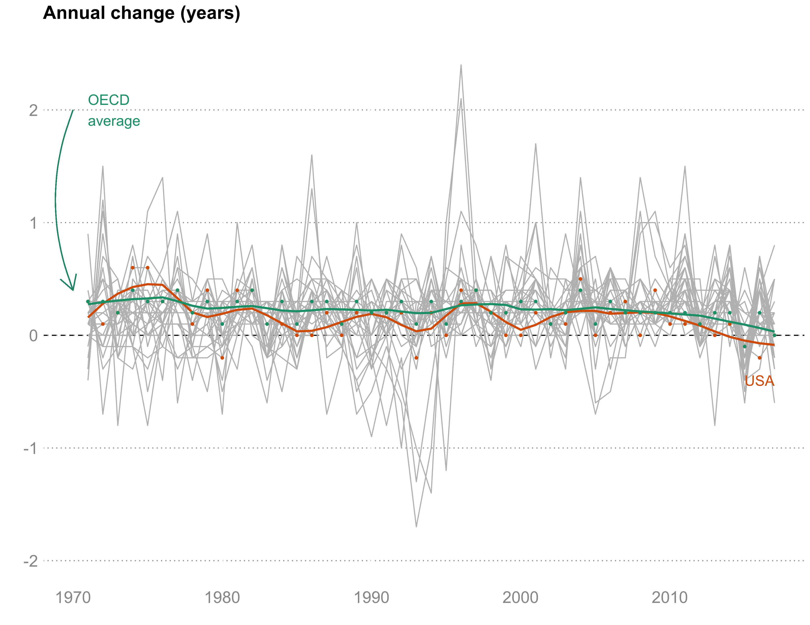

```{r setup, include=FALSE}
knitr::opts_chunk$set(echo = FALSE)
```

# \textsf{DATA SOURCES AND METHODS}  

## \textsf{Data}  

We used a number of data sources to construct plots and to analyze life expectancy trends. Data on The underlying data source for our study was the US National Vital Statistics System, maintained by the National Center for Health Statistics (NCHS), which collects information on all deaths occurring in the United States each year. Although NCHS collects data on race and gender, accurate mortality statistics for Indigenous Americans are difficult to produce because of misclassification of Indigenous individuals as white on death certificates. Thirty percent of deaths to Indigenous individuals are estimated to be misclassified, hindering abilities to calculate life expectancy, attribute changes to specific causes of death, or calculate accurate, cause-specific mortality rates. In 2008, Arias and colleagues adjusted for misreporting of Indigenous ethnicity and estimated life expectancy for this group to be 71.1, 2.8 years lower than the next-lowest life expectancy estimate for Non-Hispanic Blacks. The age-adjusted mortality rate from opioid overdoses (not adjusted for ethnicity misreporting) was estimated to be between the mortality rates for non-Hispanic whites and non-Hispanic blacks during 2017-2018 (4). Even with under-reporting Indigenous Americans have the highest reported rates of suicide, and the second-highest reported rate of homicide in 2016 (5). While based on older data from 2009-2011, age-adjusted mortality rates that also adjusted for misreporting of Indigenous ethnicity were higher than the rates computed for all races for nearly all causes of death, with the highest rate ratios for alcohol-induced deaths, chronic liver disease and cirrhosis, diabetes, injuries, influenza/pneumonia, and drug poisoning (all with rate ratios >= 1.8) (6).

### CDC WONDER
We extracted mortality data by age, gender, and cause of death for various analyses using the CDC's Wide-ranging Online Data for Epidemiologic Research, called WONDER [@wonder2020]


### SEER Stat  
We calculated mortality rates by single-year-of-age and cause of death between 1983 and 2003 using software from the National Cancer Institute's Surveillance Research Program [@nci2019],for which the National Center for Health Statistics provides the underlying mortality data and population estimates.

Accurate mortality statistics for Indigenous Americans are difficult to produce because of misclassification of Indigenous individuals as white on death certificates.  Thirty percent of deaths to Indigenous individuals are estimated to be misclassified, hindering abilities to calculate life expectancy, attribute changes to specific causes of death, or calculate accurate, cause-specific mortality rates. In 2008, Arias and colleagues adjusted for misreporting of Indigenous ethnicity and estimated life expectancy for this group to be 71.1, 2.8 years lower than the next-lowest life expectancy estimate for Non-Hispanic Blacks (3). The age-adjusted mortality rate from opioid overdoses (not adjusted for ethnicity misreporting) was estimated to be between the mortality rates for non-Hispanic whites and non-Hispanic blacks during 2017-2018 (4). Even with under-reporting Indigenous Americans have the highest reported rates of suicide, and the second-highest reported rate of homicide  in 2016 (5). While based on older data from 2009-2011, age-adjusted mortality rates that also adjusted for misreporting of Indigenous ethnicity were higher than the rates computed for all races for nearly all causes of death, with the highest rate ratios for alcohol-induced deaths, chronic liver disease and cirrhosis, diabetes, injuries, influenza/pneumonia, and drug poisoning (6).

## \textsf{Estimation of life expectancy and decomposition}  
We used standard methods for creating abridged life tables [@preston2001], with nineteen 5-year age groups (0-1, 1-4, 5-9, ... , 85+) . We calculated the contribution of each age group and cause-of-death to the difference in life expectancy between the years 2014 and 2017 using the methods developed by Arriaga [@arriaga1984]. Briefly, the contribution of a particular age group is both a direct function of the difference in age-specific mortality rates at that age plus an additional contribution resulting from the fact that mortality differences at a given age will produce additional survivors at older ages [@arriaga1984], given by the formula below:

$$ _{n}\Delta_{x}=\left[\underbrace{l_{x}^{2017}/l_{0}^{2017}}_{\textrm{fraction of survivors}}\times\overbrace{\left(\dfrac{_{n}L_{x}^{2014}}{l_{x}^{2014}}-\dfrac{_{n}L_{x}^{2017}}{l_{x}^{2017}}\right)}^{\textrm{direct effect}}\right]+\overbrace{\left[\dfrac{T_{x+n}^{2014}}{l_{x+n}^{2014}}\times\dfrac{\dfrac{l_{x}^{2017}l_{x+n}^{2014}}{l_{x}^{2014}}-l_{x+n}^{2017}}{l_{0}^{2017}}\right]}^{\textrm{indirect effect + interaction}} $$
where $_{n}\Delta_{x}$ is the total contribution for a given age
interval between $x$ and $x+n$, $l_{x}$ is number alive at age
$x$, $L_{x}$ is the person-years lived in interval, and $T_{x}$
is the person-time lived beyond age $x$. 

The contribution $_{n}\Delta_{x}^{i}$ of each cause of death $i$
within a given age group is a function of the difference between the
two populations in the proportion of deaths due to a given cause [@arriaga1989]: 

\[
_{n}\Delta_{x}^{i}={}_{n}\Delta_{x}\times\dfrac{\overbrace{\left(_{n}p_{x}^{i,2014}\times{}_{n}r_{x}^{2014}\right)-\left(_{n}p_{x}^{i,2017}\times{}_{n}r_{x}^{2017}\right)}^{\textrm{difference in share of deaths for cause}\,i}}{\underbrace{_{n}r_{x}^{2014}-_{n}r_{x}^{2017}}_{\textrm{overall mortality rate difference}}}
\]

where $_{n}\Delta_{x}$ is the total contribution for an age group,
$_{n}p_{x}^{i}$ is the proportion of deaths within age group $x$
due to cause $i$, and $_{n}r_{x}$ is the overall age-specific death
rate. The total difference in life expectancy is the net sum of the
age-cause components:

\[
\sum_{i}{}_{n}\Delta_{x}^{i}={}_{n}\Delta_{x},\:\textrm{and}\:e_{0}^{2014}-e_{0}^{2017}=\sum_{x}{}_{n}\Delta_{x}=\sum_{x}\sum_{i}{}_{n}\Delta_{x}^{i}
\]

The total difference in life expectancy at birth between 2017 and 2014 is the sum of the age-cause specific components. The total contribution of a given age group to the difference in life expectancy is equal to the sum of its contributions across
all causes of death. Likewise, the contribution of a particular cause
of death is the sum of its contributions across age groups. 

# \textsf{SUPPLEMENTAL TABLES AND FIGURES} 
The data and code to reproduce these tables and figures are provided here:  

\newpage

**Supplemental Table 1.** Life expectancy by gender and race-ethnicity, 1999-2018. Source: Authors’ calculations of data from CDC WONDER [@wonder2020]. Data: https://osf.io/y4fzx/, https://osf.io/wsdvb/ Code: https://osf.io/ewxm7/  

\begin{table}[h]
\begin{tabular}{@{}llllllllllll@{}}
\toprule
          & \multicolumn{2}{l}{Non-Hispanic API} &  & \multicolumn{2}{l}{Non-Hispanic Black} &  & \multicolumn{2}{l}{Non-Hispanic White} &  & \multicolumn{2}{l}{Hispanic} \\ \cmidrule(lr){2-3} \cmidrule(lr){5-6} \cmidrule(lr){8-9} \cmidrule(l){11-12} 
Year      & Women             & Men              &  & Women              & Men               &  & Women              & Men               &  & Women         & Men          \\ \midrule
1999      & 86.6              & 81.3             &  & 74.9               & 67.8              &  & 79.8               & 74.7              &  & 83.0          & 77.2         \\
2000      & 87.0              & 81.6             &  & 75.0               & 68.1              &  & 79.9               & 74.8              &  & 83.3          & 77.4         \\
2001      & 87.1              & 82.0             &  & 75.3               & 68.4              &  & 79.9               & 74.9              &  & 83.3          & 77.6         \\
2002      & 87.3              & 82.2             &  & 75.3               & 68.6              &  & 79.9               & 74.9              &  & 83.5          & 77.7         \\
2003      & 87.4              & 82.5             &  & 75.5               & 68.8              &  & 80.0               & 75.1              &  & 83.6          & 77.9         \\
2004      & 87.8              & 83.1             &  & 76.0               & 69.3              &  & 80.4               & 75.5              &  & 84.2          & 78.6         \\
2005      & 87.9              & 82.9             &  & 76.1               & 69.4              &  & 80.4               & 75.5              &  & 84.1          & 78.2         \\
2006      & 88.1              & 83.3             &  & 76.6               & 69.8              &  & 80.6               & 75.8              &  & 84.4          & 78.9         \\
2007      & 88.5              & 83.8             &  & 77.0               & 70.2              &  & 80.9               & 76.0              &  & 84.9          & 79.3         \\
2008      & 88.3              & 84.0             &  & 77.3               & 70.9              &  & 80.8               & 76.0              &  & 84.8          & 79.7         \\
2009      & 88.7              & 84.2             &  & 77.8               & 71.4              &  & 81.2               & 76.4              &  & 85.4          & 80.1         \\
2010      & 88.8              & 84.1             &  & 78.1               & 71.8              &  & 81.2               & 76.5              &  & 85.4          & 80.2         \\
2011      & 89.2              & 84.7             &  & 78.3               & 72.2              &  & 81.2               & 76.5              &  & 85.8          & 80.8         \\
2012      & 89.1              & 84.8             &  & 78.6               & 72.3              &  & 81.3               & 76.6              &  & 85.8          & 80.9         \\
2013      & 89.5              & 84.7             &  & 78.6               & 72.4              &  & 81.3               & 76.6              &  & 86.0          & 81.0         \\
2014      & 90.0              & 85.5             &  & 78.8               & 72.7              &  & 81.3               & 76.6              &  & 86.3          & 81.3         \\
2015      & 89.7              & 85.4             &  & 78.8               & 72.4              &  & 81.1               & 76.5              &  & 86.3          & 81.2         \\
2016      & 89.7              & 85.5             &  & 78.6               & 72.1              &  & 81.2               & 76.3              &  & 86.4          & 81.1         \\
2017      & 89.7              & 85.3             &  & 78.8               & 72.0              &  & 81.1               & 76.3              &  & 86.4          & 81.1         \\
2018      & 90.0              & 85.5             &  & 78.8               & 72.0              &  & 81.3               & 76.4              &  & 86.5          & 81.0         \\
Changes   &                   &                  &  &                    &                   &  &                    &                   &  &               &              \\
2014-2017 & -0.3              & -0.2             &  & 0.0                & -0.7              &  & -0.2               & -0.3              &  & 0.1           & -0.2         \\
2010-2018 & 1.2               & 1.4              &  & 0.7                & 0.2               &  & 0.1                & -0.1              &  & 1.1           & 0.8          \\ \bottomrule
\end{tabular}
\end{table}

\newpage
**Supplemental Figure 1.** Life expectancy at birth in the United States and 29 other high-income countries, 1969-2017. Source: World Development Indicators [@theworldbankgroup2020]. Data: https://osf.io/d2b7c/, https://osf.io/n4mj6/ Code: https://osf.io/muyrk/
```{r, out.width = "100%"}

```

\newpage
**Supplemental Figure 2.** Annual year-on-year change in life expectancy, USA and average of 29 other OECD countries. Source: World Development Indicators [@theworldbankgroup2020]. Data: https://osf.io/d2b7c/, https://osf.io/n4mj6/ Code: https://osf.io/muyrk/
```{r, out.width = "100%"}

```

\newpage
**Supplemental Figure 3.** Trends the gender gap in life expectancy by age and race-ethnicity, 1999-2018. Source: Authors' calculations of data from CDC WONDER [@wonder2020]. Data: https://osf.io/4s2rz/ Code: https://osf.io/5xywp/
```{r, out.width = "100%"}

```

\newpage
**Supplemental Figure 4.** Life expectancy at age 25 and age 65 in the United States, by gender and race-ethnicity, 1999-2018. Source: Authors' calculations of data from CDC WONDER [@wonder2020]. Data: https://osf.io/hz864/ https://osf.io/4s2rz/ Code:
```{r, out.width = "100%"}
knitr::include_graphics("../figures/le-jp2565.png")
```

\newpage
**Supplemental Figure 5.** Mortality rates by single years of age by race-ethnicity for women, ages 25-64. Source: Authors' calculations of data from CDC WONDER [@wonder2020]. Data: https://osf.io/uvyx4/, https://osf.io/pytev/ Code: https://osf.io/vb28p/
```{r, out.width = "90%"}

```

\newpage
**Supplemental Figure 6.** Mortality rates by single years of age by race-ethnicity for men, ages 25-64. Source: Authors' calculations of data from CDC WONDER [@wonder2020]. Data: https://osf.io/uvyx4/, https://osf.io/pytev/ Code: https://osf.io/vb28p/
```{r, out.width = "90%"}

```


\newpage
**Supplemental Figure 7.** Age groups contributing to the change in life expectancy at birth in the United States between 2010 and 2018, by gender and race-ethnicity. Red color indicates age groups contributing a decline, blue color indicates age groups contributing an increase. Source: Authors' calculations of data from CDC WONDER [@wonder2020]. Data: https://osf.io/tk8q3/, https://osf.io/mctx3/ https://osf.io/utdnv/ Code: https://osf.io/g9mp2/, https://osf.io/qd5w4/
```{r, out.width = "100%"}

```

\newpage
**Supplemental Figure 8.** Age-adjusted death rates per 100,000 by urban (purple) or rural (green) categorization, 1969-2016. Source: Authors' calculations of data from SEER*Stat [@nci2019].  Data: Code:
```{r, out.width = "100%"}

```


\newpage
**Supplemental Figure 9.** Decomposition of the urban-rural life expectancy gap by cause-of-death, 1969-71 and 2012-16. Source: Authors' calculations of data from SEER*Stat (3).  Data: Code:
```{r, out.width = "100%"}

```


\newpage
**Supplemental Figure 10.** Trends in age-adjusted unintentional poisoning death rates by urban-rural classification scheme, 1999-2018. Source: Authors' calculations of data from SEER*Stat (3).  Data: Code:
```{r sf10, out.width = "100%"}

```

\newpage
**Supplemental Figure 11.** Trends in age-adjusted liver cancer death rates by race-ethnicity and gender, 1999-2018. Source: Authors' calculations of data from CDC WONDER (1). Data: Code:
```{r sf11, out.width = "100%"}

```

\newpage
**Supplemental Figure 12.** Causes of death contributing to the change in life expectancy at birth in the United States between 2010 and 2018, by gender and race-ethnicity. Red color indicates causes contributing a decline, blue color indicates causes contributing an increase. Source: Authors’ calculations of data from CDC WONDER [@wonder2020]. Data: https://osf.io/tk8q3/, https://osf.io/mctx3/, https://osf.io/utdnv/ Code: https://osf.io/g9mp2/, https://osf.io/qd5w4/
```{r sf12, out.width = "100%"}

```

\newpage
**Supplemental Figure 13.** Age-adjusted death rates per 100,000 for non-Hispanic white men aged 45-54, by state, 2010-2018. Source: Authors’ calculations of data from CDC WONDER [@wonder2020]. Data: Code:
```{r sf13, out.width = "100%"}

```


\newpage
# \textsf{LITERATURE CITED}  


